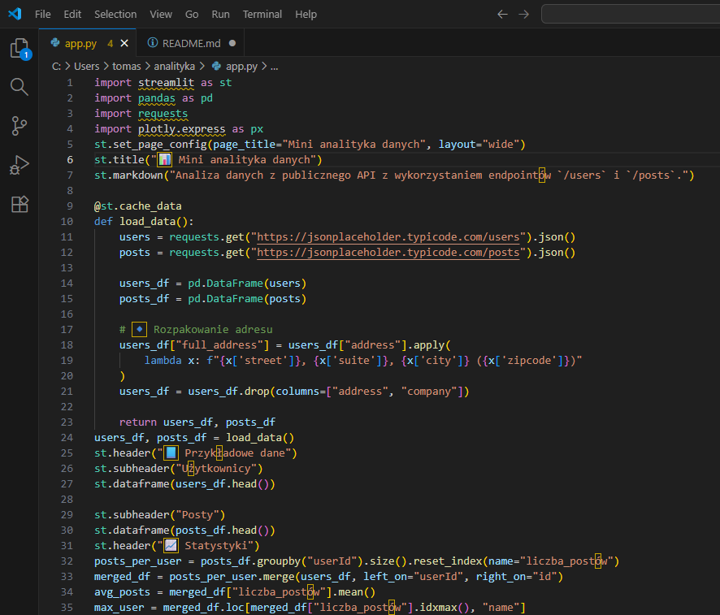
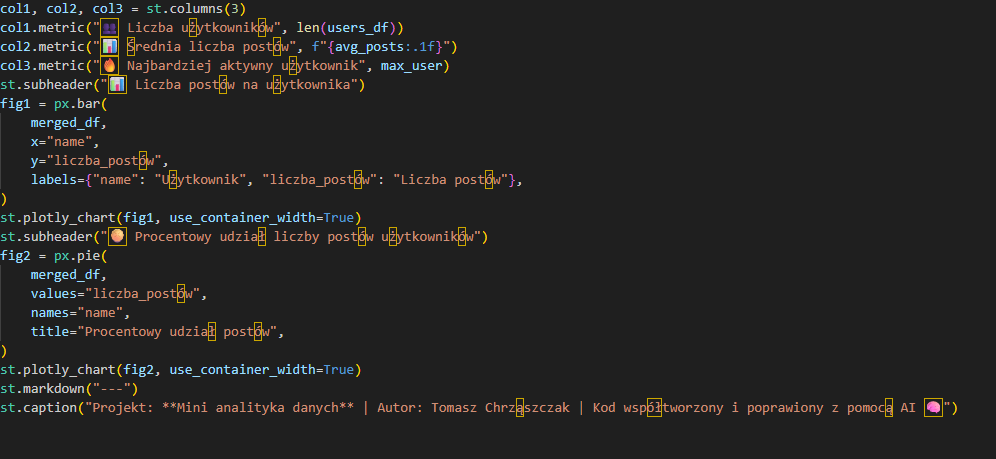

# Mini analiza danych

Projekt w Streamlit, który pobiera dane z publicznego API [JSONPlaceholder](https://jsonplaceholder.typicode.com), analizuje je i wizualizuje w postaci prostych wykresów.

## Technologia
- python
- streamlit
- pandas
- matplotlib

## Funkcje
- Pobiera dane z endpontów /users i /posts
- Oblicza:
    - Liczbę użytkowników
    - Pokazuje najbadziej aktywnego użytkownika
    - średnią liczbę postów
- Wizualizacje:
    - użytkowników i informacje o nich
    - informacje o postach użytkowników
    - w postaci wykresu słupkowego do wizualizacji liczby postów na użytkownika
    - wykres kołowy udziału użytkowników w procentach

## Proces tworzenia
- Aplikacja została opracowana iteracyjnie, podczas implementacji dokonano kilku poprawek i optymalizacji kodu aby zwiększyć czytelność i stabilność. W trakcie pracy wykorzystano sztuczną intelegencję asystenta ChatGPT, który pomagał w dopracowaniu logiki analizy danych oraz organizacji kodu w sposób bardziej przejrzysty i efektywny.
- po utworzeniu potrzebnych folderów (pliku app.py, requirements.txt oraz read.md) oraz po instalacji potrzebnych bilbiotek spytałem AI o szkielet aplikacji takich jak nagłówek i podstawowe importy. Dodałem funkcję buforowania danych żeby podczas każdego wczytywania nie trzeba było pobierać jej danych na nowo. Spytałem AI o cały design aplikacji tzn. jak całościowo ma wyglądać ta strona. . Miałem także problem z kolumną full adress, ponieważ widniał tam sam kod, który potem naprawiłem by pokazywało zwyczajny adres. ChatGPT pomógł mi także w wyliczaniu metryk i statystyk przy okazji dając mi komonenty col1, col2 i col3. Chat pomógl mi rownież z wizualizacją wykresów słupkowych (użyłem plotly do stworzenia interaktywnego wykresu) oraz kołowych. Dane są przetwarzane w pandas (czyszczenie, liczenie, łączenie)

 ## Przykładowy zrzut ekranu
, 